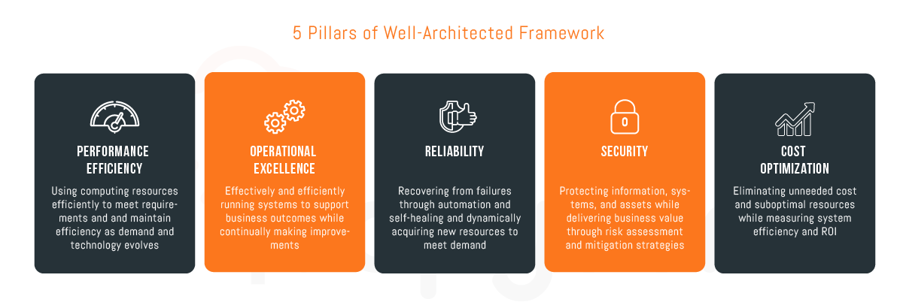

	<a href="https://d1.awsstatic.com/whitepapers/architecture/AWS_Well-Architected_Framework.pdf">
		Well Architected Framework for AWS 
	</a>

  

A curated list of helpful AWS-Well-Architected resources.

- [Whitepapers & Guides](#-whitepapers--guides)
- [Well Architected Lens]()
- [AWS Solutions Library](#-AWS-Solutions-Library)
- [Reference Architecture Diagrams](#-aws-reference-architecture-diagrams)
- [The Amazon Builders' Library](#-aws-reference-architecture-diagrams)
- [Well Architected Tool](#-aws-well-architected-tool)
- [AWS Well-Architected Labs](#-aws-well-architected-labs)
- [This is My Architecture Video Series](#-this-is-my-architecture-video-series)
- [AWS Online Tech Talks](#-aws-online-tech-talks)
- [Blogs](#-blogs)
- [Icons](#-icons)

##  Whitepapers & Guides

Whitepapers & Guides for AWS...

- `whitepapers-collection` [White Papers](https://aws.amazon.com/whitepapers/?whitepapers-main.sort-by=item.additionalFields.sortDate&whitepapers-main.sort-order=desc&awsf.whitepapers-content-type=content-type%23reference%7Ccontent-type%23whitepaper&awsf.whitepapers-content-category=*all) — Expand your knowledge of the cloud with AWS technical content authored by AWS and the AWS community, including technical whitepapers, technical guides, reference material, and reference architecture diagrams.

- `technical-guide` [Technical Guide](https://aws.amazon.com/whitepapers/?whitepapers-main.sort-by=item.additionalFields.sortDate&whitepapers-main.sort-order=desc&awsf.whitepapers-content-type=content-type%23tech-guide&awsf.whitepapers-content-category=*all) — Learn practices through technical guides.

#  Well-Architected lens

Well-Architected lens for AWS...

- `serverless` [Serverless Application](https://d1.awsstatic.com/whitepapers/architecture/AWS-Serverless-Applications-Lens.pdf) — This “Lens”  focus on how to design, deploy, and architect your serverless application workloads on the AWS Cloud. It covers scenarios such as RESTful Microservices, Mobile back-ends, Stream Processing, and Web Application. By using this Well-Architected lens you will learn best practices for building serverless application workloads on AWS.

- `HPC` [High Performance Computing](https://d1.awsstatic.com/whitepapers/architecture/AWS-IoT-Lens.pdf) — This “Lens”  focus on how to design, deploy, and architect your serverless application workloads on the AWS Cloud. It covers scenarios such as RESTful Microservices, Mobile back-ends, Stream Processing, and Web Application. By using this Well-Architected lens you will learn best practices for building serverless application workloads on AWS.

- `iot` [IoT (Internet of Things)](https://d1.awsstatic.com/whitepapers/architecture/AWS-IoT-Lens.pdf) — This “Lens”  focus on how to design, deploy, and architect your High-Performance Computing (HPC) workloads on the AWS Cloud. It covers scenarios such as Loosely Coupled/High-Throughput Computing and Tightly Coupled/High-Performance Computing. By using this Well-Architected lens you will learn best practices for building HPC workloads on AWS.

- `ML` [Machine Learning](https://d1.awsstatic.com/whitepapers/architecture/wellarchitected-Machine-Learning-Lens.pdf) — This “Lens” focus on common machine learning (ML) scenarios and identify key elements to ensure that your workloads are architected according to best practices in the AWS cloud. It covers scenarios such as securing your ML datasets, architecting your ML pipelines, and best practices for cost and reliability of your ML workloads.

##  AWS Solutions Library

The AWS Solutions Library offers a collection of cloud-based solutions for dozens of technical and business problems, vetted for you by AWS. 

- `Soltions` [Solution Collections](https://aws.amazon.com/solutions/?nc1=f_cc) — AWS Solutions Implementations help you solve common problems and build faster using the AWS platform. All AWS Solutions Implementations are vetted by AWS architects and are designed to be operationally effective, reliable, secure, and cost efficient. Every AWS Solutions Implementation comes with detailed architecture, a deployment guide, and instructions for both automated and manual deployment.

##  AWS Reference Architecture Diagrams

How to architect your AWS projects...

- `collection` [Reference diagram curated collections](https://aws.amazon.com/architecture/?solutions-all.sort-by=item.additionalFields.sortDate&solutions-all.sort-order=desc&whitepapers-main.sort-by=item.additionalFields.sortDate&whitepapers-main.sort-order=desc&reference-architecture.sort-by=item.additionalFields.sortDate&reference-architecture.sort-order=desc) — The flexibility of AWS enables you to design your application architectures the way you like. AWS Reference Architecture Diagrams provide you with the architectural guidance you need to build an application that takes full advantage of the AWS Cloud. Each diagram includes a visual representation of the application architecture and a basic description of how each service is used.

##  The Amazon Builders' Library 

The content in The Builders’ Library is written by Amazon’s senior technical leaders and engineers covering topics across architecture, software delivery, and operations. For example, readers can see how Amazon automates software delivery to achieve over 150 million deployments a year or how Amazon’s engineers implement principles such as shuffle sharding to build resilient systems that are highly available and fault tolerant.

- `The Amazon Builders' Library` [How Amazon builds and operates software](https://aws.amazon.com/builders-library/) — The Amazon Builders’ Library is a collection of living articles that describe how Amazon develops, architects, releases, and operates technology. 

##  AWS Well Architected Tool

The AWS Well-Architected Tool helps you review the state of your workloads and compares them to the latest AWS architectural best practices. The tool is based on the AWS Well-Architected Framework, developed to help cloud architects build secure, high-performing, resilient, and efficient application infrastructure

- `Tooling` - [Well Architected Tool] (https://aws.amazon.com/well-architected-tool/) — To use this free tool, available in the AWS Management Console, just define your workload and answer a set of questions regarding operational excellence, security, reliability, performance efficiency, and cost optimization. The AWS Well-Architected Tool then provides a plan on how to architect for the cloud using established best practices.

##  AWS Well-Architected Labs 

This repository contains documentation and code in the format of hands-on labs to help you learn, measure, and build using architectural best practices. The labs are categorized into levels, where 100 is introductory, 200/300 is intermediate and 400 is advanced.

- `Hand-on Labs` [AWS Well-Architected Labs](https://wellarchitectedlabs.com/README.html) — Try out effectiveness of your architecture and learn more about best-practices.
-  `Official Github Repository`   [Github](https://github.com/awslabs/aws-well-architected-labs/)
 

##  This is My Architecture Video Series

Short interviews with AWS customers reviewing the design choices they made in architecting applications they have built for their organization.

- `My Architecture Vidoes` [This is My Architecture Video Series](https://aws.amazon.com/blogs/architecture/) — Innovative cloud architectures from AWS partners and customers

##  AWS Online Tech Talks

Online presentations led by AWS solutions architects and engineers. AWS Online Tech Talks cover a range of topics and expertise levels, and feature technical deep dives, demonstrations, customer examples, and live Q&A with AWS experts.

- `AWS Online Tech Talks` [Online presentations led by AWS solutions architects and engineers](https://aws.amazon.com/blogs/architecture/) 

##  Blogs

Blogs around the internet that often (or exclusively) write about AWS Well Architected...

- `blog` [Architected Blog](https://aws.amazon.com/blogs/architecture/) — the official AWS Architecture blog.

##  Icons
On this page you will find an official collection of AWS Architecture Icons (formerly Simple Icons) that contain AWS product icons, resources, and other tools to help you build diagrams.

- `icons` [AWS Architecture Icons](https://aws.amazon.com/architecture/icons/) — the official collection of AWS Architecture Icons.
